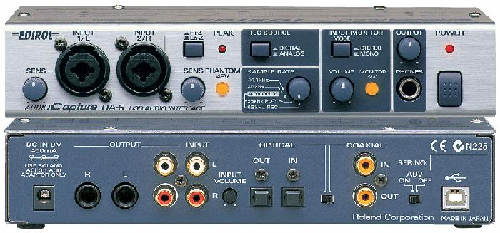
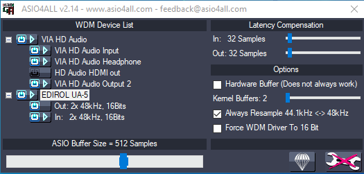

# Roland Edirol ua5 USB



## Windows Drivers

Under windows 10, I installed [ASIO all](https://www.asio4all.org/) drivers for this device.

My Asio4All Setup with the VIA onboard souncard and UA5-USB soundcard:



## The logs generated by rs_asio

**RS_ASIO-log.txt**

```
...
0.494 [INFO]  AsioHelpers::FindDrivers
0.495 [INFO]    ASIO4ALL v2
0.495 [INFO]  RSAsioDeviceEnum::UpdateAvailableDevices - output requesting ASIO driver: ASIO4ALL v2
0.495 [INFO]  Creating AsioSharedHost - dll: C:\Program Files (x86)\ASIO4ALL v2\asio4all.dll
1.169 [INFO]    info: asio4all detected
1.169 [INFO]    ASIO input channels info:
1.169 [INFO]      0 - active: 0, channel: 0, group: 0, isInput: 1, type: ASIOSTInt32LSB, name: VIA HD Audio Input 1
1.169 [INFO]      1 - active: 0, channel: 1, group: 0, isInput: 1, type: ASIOSTInt32LSB, name: VIA HD Audio Input 2
1.169 [INFO]      2 - active: 0, channel: 2, group: 0, isInput: 1, type: ASIOSTInt32LSB, name: EDIROL UA-5 1
1.169 [INFO]      3 - active: 0, channel: 3, group: 0, isInput: 1, type: ASIOSTInt32LSB, name: EDIROL UA-5 2
1.169 [INFO]    ASIO output channels info:
1.169 [INFO]      0 - active: 0, channel: 0, group: 0, isInput: 0, type: ASIOSTInt32LSB, name: VIA HD Audio Headphone 1
1.169 [INFO]      1 - active: 0, channel: 1, group: 0, isInput: 0, type: ASIOSTInt32LSB, name: VIA HD Audio Headphone 2
1.169 [INFO]      2 - active: 0, channel: 2, group: 0, isInput: 0, type: ASIOSTInt32LSB, name: VIA HD Audio Output 2 1
1.169 [INFO]      3 - active: 0, channel: 3, group: 0, isInput: 0, type: ASIOSTInt32LSB, name: VIA HD Audio Output 2 2
1.169 [INFO]      4 - active: 0, channel: 4, group: 0, isInput: 0, type: ASIOSTInt32LSB, name: VIA HD Audio Output 2 3
1.169 [INFO]      5 - active: 0, channel: 5, group: 0, isInput: 0, type: ASIOSTInt32LSB, name: VIA HD Audio Output 2 4
1.169 [INFO]      6 - active: 0, channel: 6, group: 0, isInput: 0, type: ASIOSTInt32LSB, name: VIA HD Audio Output 2 5
1.169 [INFO]      7 - active: 0, channel: 7, group: 0, isInput: 0, type: ASIOSTInt32LSB, name: VIA HD Audio Output 2 6
1.169 [INFO]      8 - active: 0, channel: 8, group: 0, isInput: 0, type: ASIOSTInt32LSB, name: EDIROL UA-5 1
1.169 [INFO]      9 - active: 0, channel: 9, group: 0, isInput: 0, type: ASIOSTInt32LSB, name: EDIROL UA-5 2
1.169 [INFO]  RSAsioDeviceEnum::UpdateAvailableDevices - OK
1.169 [INFO]  RSAsioDeviceEnum::UpdateAvailableDevices - input[0] requesting ASIO driver: ASIO4ALL v2
1.169 [INFO]  RSAsioDeviceEnum::UpdateAvailableDevices - OK
1.170 [INFO]  DebugDeviceEnum::UpdateAvailableDevices - 1 render devices, 1 capture devices
1.170 [INFO]    hr: S_OK
1.170 [INFO]    *ppEndpoint: 21E07530
1.170 [INFO]  DebugDeviceEnum::GetDefaultAudioEndpoint - dataFlow: eCapture - role: eMultimedia
1.170 [INFO]    hr: S_OK
1.170 [INFO]    *ppEndpoint: 21E07410
1.170 [INFO]  DebugDeviceEnum::EnumAudioEndpoints - dataFlow: eAll - dwStateMask: 1
1.170 [INFO]    hr: S_OK
1.170 [INFO]    *ppDevices: 0CE5A1F0
...
```

## Config files - Guitar plugged into input 2/R

This is my configuration, adapt yours according to your RS_ASIO log file.

**RS_ASIO.ini**

```ini
[Config]
EnableWasapiOutputs=0
EnableWasapiInputs=0
EnableAsio=1

[Asio]
; available buffer size modes:
;    driver - respect buffer size setting set in the driver
;    host   - use a buffer size as close as possible as that requested by the host application
;    custom - use the buffer size specified in CustomBufferSize field
BufferSizeMode=driver
CustomBufferSize=

[Asio.Output]
Driver=ASIO4ALL v2
; VIA HD Audio Output 2
BaseChannel=2
; VIA HD Audio Headphone
AltBaseChannel=1
; Output Headphone Edirol
;BaseChannel=8
EnableSoftwareEndpointVolumeControl=1
EnableSoftwareMasterVolumeControl=1
SoftwareMasterVolumePercent=100

[Asio.Input.0]
Driver=ASIO4ALL v2
Channel=3
EnableSoftwareEndpointVolumeControl=1
EnableSoftwareMasterVolumeControl=1
SoftwareMasterVolumePercent=100

[Asio.Input.1]
Driver=
Channel=1
EnableSoftwareEndpointVolumeControl=1
EnableSoftwareMasterVolumeControl=1
SoftwareMasterVolumePercent=100


[Asio.Input.Mic]
Driver=
Channel=1
EnableSoftwareEndpointVolumeControl=1
EnableSoftwareMasterVolumeControl=1
SoftwareMasterVolumePercent=100
```
